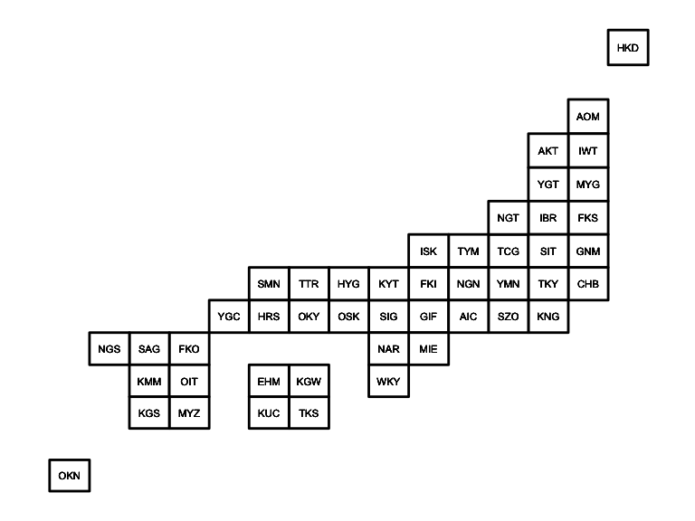
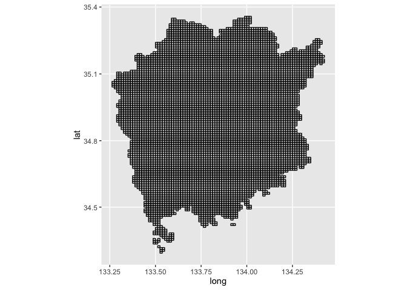

<!-- README.md is generated from README.Rmd. Please edit that file -->
jpmesh 
========================================================

[](https://travis-ci.org/uribo/jpmesh) [](https://cran.r-project.org/package=jpmesh) [](https://codecov.io/gh/uribo/jpmesh)

Overview
--------

The **`{jpmesh}`** package is a package that makes it easy to use "regional mesh (i.e. mesh code *JIS X 0410* )" used in Japan from R. Regional mesh is a code given when subdividing Japanese landscape into rectangular subregions by latitude and longitude. Depending on the accuracy of the code, different regional mesh length. By using the same mesh in statistical survey etc., it will become possible to handle the survey results of a large area in the area mesh unit.

In jpmesh, mesh codes and latitude and longitude coordinates are compatible with mesh codes from the first region mesh, which is the standard region mesh, to the quarter regional mesh of the divided region mesh (from 80 km to 250 m). Features include "conversion from latitude and longitude to regional mesh", "acquisition of latitude and longitude from regional mesh", "mapping on prefecture unit and leaflet".

Installation
------------

Fron CRAN

``` r
install.packages("jpmesh")
```

For developers

``` r
# the development version from GitHub:
install.packages("devtools")
devtools::install_github("uribo/jpmesh")
```

Usage
-----

``` r
library(jpmesh)
library(dplyr, warn.conflicts = FALSE)
library(ggplot2)
```

### Convert mesh code to coordinate and vice versa

Return the latitude and longitude for specifying the mesh range from the mesh code.

``` r
meshcode_to_latlon(5133)
#>   lat_center long_center lat_error long_error
#> 1   34.33333       133.5 0.3333333        0.5
meshcode_to_latlon(513377)
#>   lat_center long_center  lat_error long_error
#> 1     34.625    133.9375 0.04166667     0.0625
meshcode_to_latlon(51337783)
#>   lat_center long_center   lat_error long_error
#> 1   34.65417    133.9187 0.004166667    0.00625
```

Find the mesh code within the range from latitude and longitude.

``` r
latlong_to_meshcode(34, 133, order = 1)
#> [1] 5133
latlong_to_meshcode(34.583333, 133.875, order = 2)
#> [1] 513367
latlong_to_meshcode(34.65, 133.9125, order = 3)
#> [1] 51337782
```

### Detect fine mesh code

``` r
detect_mesh(52350422, lat = 34.684176, long = 135.526130)
#> [1] 523504221
detect_mesh(523504221, lat = 34.684028, long = 135.529506)
#> [1] 5235042212
```

### Utilies

Drawing a simplified Japanese map based on the mesh code.

``` r
data("jpnrect")

ggplot() +
  geom_map(data = jpnrect,
           map  = jpnrect,
           aes(x = long, y = lat, map_id = id),
           fill = "#FFFFFF", color = "black",
           size = 1) +
  coord_map() +
  ggthemes::theme_map() +
  geom_text(aes(x = longitude, y = latitude, label = abb_name), data = jpnrect, size = 3)
```



Dataset of mesh code for prefectures.

``` r
pref_mesh(33) %>% head() %>% knitr::kable()
```

| jiscode |      long|       lat|  order| group      |        id| city\_code | city\_name |
|:--------|---------:|---------:|------:|:-----------|---------:|:-----------|:-----------|
| 33      |  133.5250|  34.30000|      1| 51333452.1 |  51333452| 33205      | 笠岡市     |
| 33      |  133.5375|  34.30000|      2| 51333452.1 |  51333452| 33205      | 笠岡市     |
| 33      |  133.5375|  34.29167|      3| 51333452.1 |  51333452| 33205      | 笠岡市     |
| 33      |  133.5250|  34.29167|      4| 51333452.1 |  51333452| 33205      | 笠岡市     |
| 33      |  133.5250|  34.30000|      5| 51333452.1 |  51333452| 33205      | 笠岡市     |
| 33      |  133.5250|  34.30833|      1| 51333462.1 |  51333462| 33205      | 笠岡市     |

Example)

``` r
# For leaflet
# pref_mesh(33) %>% mesh_rectangle(mesh_code = "id", view = TRUE)
```

``` r
df.map <- pref_mesh(33) %>% 
  mutate(mesh_area = purrr::map(id, meshcode_to_latlon)) %>% 
  tidyr::unnest() %>% 
  mutate(lng1 = long_center - long_error,
         lat1 = lat_center - lat_error,
         lng2 = long_center + long_error,
         lat2 = lat_center + lat_error)

ggplot() + 
  geom_map(data = df.map, 
           map = df.map,
           aes(x = long, y = lat, map_id = id), 
           fill = "white", color = "black") + 
  coord_map(projection = "mercator")
```


