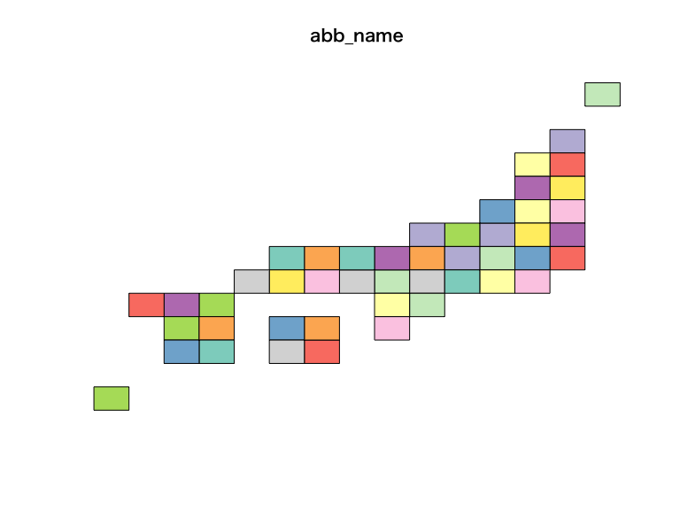

<!-- README.md is generated from README.Rmd. Please edit that file -->
jpmesh 
========================================================

[](https://travis-ci.org/uribo/jpmesh) [](https://cran.r-project.org/package=jpmesh) [](https://codecov.io/gh/uribo/jpmesh)

*English version of README is [here](https://github.com/uribo/jpmesh/blob/master/README.en.md)*

Overview
--------

**`{jpmesh}`**パッケージは、日本国内で利用される「地域メッシュ（メッシュコード）」をRから容易に利用可能にするパッケージです。地域メッシュとは、日本国土を緯度・経度により方形の小地域区画に細分した際に与えられるコードです。地域メッシュはコードの精度に応じて範囲とする区画の面積が異なっており、統計調査などでは同一メッシュを採用することで広い面積の調査結果を地域メッシュ単位で取り扱えるようになります。

**`{jpmesh}`**は現在、標準地域メッシュである第1次メッシュから分割地域メッシュの4分の1地域メッシュすなわち80kmから250mまでのメッシュコードに対応し、メッシュコードと緯度経度座標との互換を行います。主な機能として、「緯度経度からの地域メッシュへの変換」、「地域メッシュからの緯度経度の取得」、「都道府県単位やleaflet上へのマッピング」があります。

Installation
------------

CRANからインストール

``` r
install.packages("jpmesh")
```

GitHubからも開発版がインストールできます。

``` r
# the development version from GitHub:
install.packages("devtools")
devtools::install_github("uribo/jpmesh")
```

Usage
-----

``` r
library(jpmesh)
library(dplyr, warn.conflicts = FALSE)
```

### Convert mesh code to coordinate and vice versa

メッシュコードからメッシュ範囲特定のための緯度経度の取得

``` r
meshcode_to_latlon(5133)
#>      lat_center long_center    lat_error long_error
#> 1 34.3333333333       133.5 0.3333333333        0.5
meshcode_to_latlon(513377)
#>   lat_center long_center       lat_error long_error
#> 1     34.625    133.9375 0.0416666666667     0.0625
meshcode_to_latlon(51337783)
#>      lat_center long_center        lat_error       long_error
#> 1 34.6541666667   133.91875 0.00416666669999 0.00624999999999
```

緯度経度から、範囲内のメッシュコードを取得

``` r
latlong_to_meshcode(34, 133, order = 1)
#> [1] 5133
latlong_to_meshcode(34.583333, 133.875, order = 2)
#> [1] 513367
latlong_to_meshcode(34.65, 133.9125, order = 3)
#> [1] 51337782
```

### Detect fine mesh code

``` r
detect_mesh(52350422, lat = 34.684176, long = 135.526130)
#> [1] 523504221
detect_mesh(523504221, lat = 34.684028, long = 135.529506)
#> [1] 5235042212
```

### Utilies

1次メッシュを基礎とした単純化した日本地図の描画

``` r
data("jpnrect")
```

``` r
plot(jpnrect["abb_name"])
```



``` r
library(ggplot2) # 2.2.1.9000
ggplot() +
  geom_sf(data = jpnrect)
```


都道府県別のメッシュコードデータ

``` r
administration_mesh(code = 33, type = "prefecture") %>% 
  dplyr::sample_n(5) %>% 
  knitr::kable()
```

| mesh\_code | city\_code | city\_name   | geometry                                                                                                                                                  |
|:-----------|:-----------|:-------------|:----------------------------------------------------------------------------------------------------------------------------------------------------------|
| 523357     | 33606      | 苫田郡鏡野町 | 133.8750000000, 134.0000000000, 134.0000000000, 133.8750000000, 133.8750000000, 35.0833333333, 35.0833333333, 35.1666666667, 35.1666666667, 35.0833333333 |
| 523335     | 33214      | 真庭市       | 133.6250000000, 133.7500000000, 133.7500000000, 133.6250000000, 133.6250000000, 34.9166666667, 34.9166666667, 34.9999999999, 34.9999999999, 34.9166666667 |
| 523322     | 33210      | 新見市       | 133.2500000000, 133.3750000000, 133.3750000000, 133.2500000000, 133.2500000000, 34.8333333333, 34.8333333333, 34.9166666667, 34.9166666667, 34.8333333333 |
| 523430     | 33666      | 久米郡美咲町 | 134.0000000000, 134.1250000000, 134.1250000000, 134.0000000000, 134.0000000000, 34.9166666667, 34.9166666667, 34.9999999999, 34.9999999999, 34.9166666667 |
| 513376     | 33202      | 倉敷市       | 133.7500000000, 133.8750000000, 133.8750000000, 133.7500000000, 133.7500000000, 34.5833333333, 34.5833333333, 34.6666666667, 34.6666666667, 34.5833333333 |

可視化の一例

``` r
library(leaflet)
```

``` r
# For leaflet
leaflet() %>% addTiles() %>% 
  addPolygons(data = administration_mesh(code = 33101, type = "city"))
```


``` r
ggplot() + 
  geom_sf(data = administration_mesh(code = 33, type = "city"))
```


