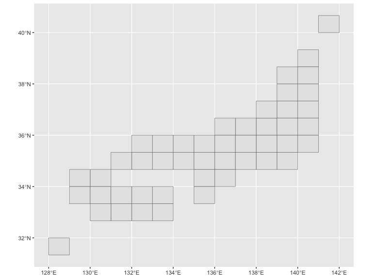

<!-- README.md is generated from README.Rmd. Please edit that file -->

# jpmesh 

[](https://cran.r-project.org/package=jpmesh)
[](https://cran.r-project.org/package=jpmesh)
[](https://cran.r-project.org/)
[](http://depsy.org/package/r/jpmesh)
[](https://doi.org/10.5281/zenodo.4291910)

[](https://codecov.io/github/uribo/jpmesh?branch=master)
[](https://github.com/uribo/jpmesh/actions?query=workflow%3AR-CMD-check)

[](https://lifecycle.r-lib.org/articles/stages.html)
[](https://github.com/uribo/jpmesh)

------------------------------------------------------------------------

## Overview

The **jpmesh** package is a package that makes it easy to use “regional
mesh (i.e. mesh code *JIS X 0410* )” used in Japan from R. Regional mesh
is a code given when subdividing Japanese landscape into rectangular
subregions by latitude and longitude. Depending on the accuracy of the
code, different regional mesh length. By using the same mesh in
statistical survey etc., it will become possible to handle the survey
results of a large area in the area mesh unit.

In jpmesh, mesh codes and latitude and longitude coordinates are
compatible with mesh codes from the first region mesh, which is the
standard region mesh, to the quarter regional mesh of the divided region
mesh (from 80 km to 100 m). Features include “conversion from latitude
and longitude to regional mesh”, “acquisition of latitude and longitude
from regional mesh”, “mapping on prefecture unit and leaflet”.

## Installation

From CRAN

``` r
install.packages("jpmesh")
```

For developers

``` r
# the development version from GitHub:
install.packages("remotes")
remotes::install_github("uribo/jpmesh")
```

## Usage

``` r
library(jpmesh)
```

### Create mesh code

``` r
meshcode(5133) # 80km
#> <meshcode[1]>
#> [1] 5133
meshcode(513377) # 10km
#> <meshcode[1]>
#> [1] 513377
meshcode(51337783) # 1km
#> <meshcode[1]>
#> [1] 51337783
meshcode(513377831) # 500m
#> <meshcode[1]>
#> [1] 513377831
meshcode(5133778312) # 250m
#> <meshcode[1]>
#> [1] 5133778312
meshcode(51337783123) # 125m
#> <meshcode[1]>
#> [1] 51337783123
meshcode(5133778300, .type = "subdivision") # 100m
#> <subdiv_meshcode[1]>
#> [1] 5133778300
```

### Convert mesh code to coordinate and vice versa

Return the latitude and longitude for specifying the mesh range from the
mesh code.

``` r
mesh_to_coords(5133) # 80km
#> # A tibble: 1 x 5
#>     meshcode lng_center lat_center lng_error lat_error
#>   <meshcode>      <dbl>      <dbl>     <dbl>     <dbl>
#> 1       5133       134.       34.3       0.5     0.333
mesh_to_coords(513377) # 10km
#> # A tibble: 1 x 5
#>     meshcode lng_center lat_center lng_error lat_error
#>   <meshcode>      <dbl>      <dbl>     <dbl>     <dbl>
#> 1     513377       134.       34.6    0.0625    0.0417
mesh_to_coords(51337783) # 1km
#> # A tibble: 1 x 5
#>     meshcode lng_center lat_center lng_error lat_error
#>   <meshcode>      <dbl>      <dbl>     <dbl>     <dbl>
#> 1   51337783       134.       34.7   0.00625   0.00417
mesh_to_coords(513377831) # 500m
#> # A tibble: 1 x 5
#>     meshcode lng_center lat_center lng_error lat_error
#>   <meshcode>      <dbl>      <dbl>     <dbl>     <dbl>
#> 1  513377831       134.       34.7   0.00312   0.00208
mesh_to_coords(5133778312) # 250m
#> # A tibble: 1 x 5
#>     meshcode lng_center lat_center lng_error lat_error
#>   <meshcode>      <dbl>      <dbl>     <dbl>     <dbl>
#> 1 5133778312       134.       34.7   0.00156   0.00104
mesh_to_coords(51337783123) # 125m
#> # A tibble: 1 x 5
#>      meshcode lng_center lat_center lng_error lat_error
#>    <meshcode>      <dbl>      <dbl>     <dbl>     <dbl>
#> 1 51337783123       134.       34.7  0.000781  0.000521
```

Find the mesh code within the range from latitude and longitude.

``` r
coords_to_mesh(133, 34) # default as 1km meshcode
#> <meshcode[1]>
#> [1] 51330000
coords_to_mesh(133, 34, mesh_size = 80)
#> <meshcode[1]>
#> [1] 5133
coords_to_mesh(133, 34, mesh_size = 0.125)
#> <meshcode[1]>
#> [1] 51330000111
```

There is `mesh_convert()` as a function to change the mesh size more
freely.

``` r
# Scale up
mesh_convert("52350432", 80)
#> <meshcode[1]>
#> [1] 5235
# Scale down
mesh_convert("52350432", 0.500)
#> <meshcode[4]>
#> [1] 523504321 523504322 523504323 523504324
```

### Detect fine and neighborhood mesh codes

``` r
# Returns a finer mesh of the area of the mesh codes
# Such as, 80km to 10km mesh codes.
coords_to_mesh(133, 34, 80) %>% 
  fine_separate()
#> <meshcode[64]>
#>  [1] 513300 513301 513302 513303 513304 513305 513306 513307 513310 513311
#> [11] 513312 513313 513314 513315 513316 513317 513320 513321 513322 513323
#> [21] 513324 513325 513326 513327 513330 513331 513332 513333 513334 513335
#> [31] 513336 513337 513340 513341 513342 513343 513344 513345 513346 513347
#> [41] 513350 513351 513352 513353 513354 513355 513356 513357 513360 513361
#> [51] 513362 513363 513364 513365 513366 513367 513370 513371 513372 513373
#> [61] 513374 513375 513376 513377

# the value of the adjacent mesh codes
coords_to_mesh(133, 34, 80) %>% 
  neighbor_mesh()
#> <meshcode[9]>
#> [1] 5032 5033 5034 5132 5133 5134 5232 5233 5234
coords_to_mesh(133, 34, 0.5) %>% 
  neighbor_mesh()
#> <meshcode[9]>
#> [1] 503277994 503370903 503370904 513207092 513207094 513300001 513300002
#> [8] 513300003 513300004
```

### Utilies

Drawing a simplified Japanese map based on the mesh code.

``` r
library(sf)
plot(st_geometry(jpnrect))
```

<!-- -->

``` r
library(ggplot2)
ggplot() +
  geom_sf(data = jpnrect)
```

<!-- -->

Dataset of mesh code for prefectures.

``` r
set.seed(71)
administration_mesh(code = 33, to_mesh_size = 80) %>% 
  head() %>% 
  knitr::kable()
```

| meshcode | geometry                     |
|:---------|:-----------------------------|
| 5133     | POLYGON ((133 34, 134 34, 1… |
| 5233     | POLYGON ((133 34.66667, 134… |
| 5234     | POLYGON ((134 34.66667, 135… |
| 5134     | POLYGON ((134 34, 135 34, 1… |
| 5333     | POLYGON ((133 35.33333, 134… |
| 5334     | POLYGON ((134 35.33333, 135… |

Example)

``` r
# For leaflet and mapview
library(leaflet)
leaflet() %>% 
  addTiles() %>% 
  addProviderTiles("OpenStreetMap.BlackAndWhite") %>% 
  addPolygons(data = administration_mesh(code = 33101, to_mesh_size = 1))
```


``` r
ggplot() + 
  geom_sf(data = administration_mesh(code = 33, to_mesh_size = 1))
```


## Code of Conduct

Please note that this project is released with a [Contributor Code of
Conduct](.github/CODE_OF_CONDUCT.md). By participating in this project
you agree to abide by its terms.
